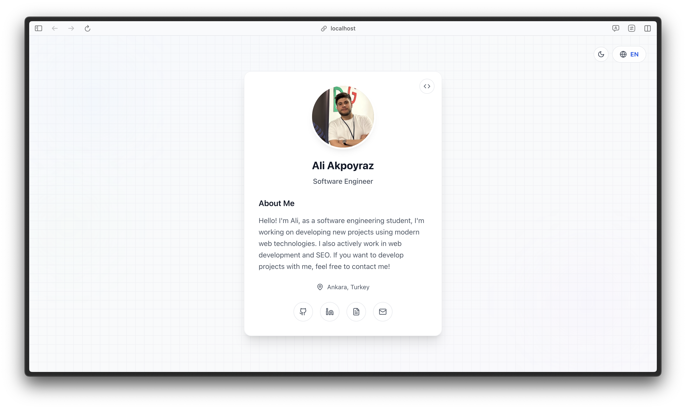
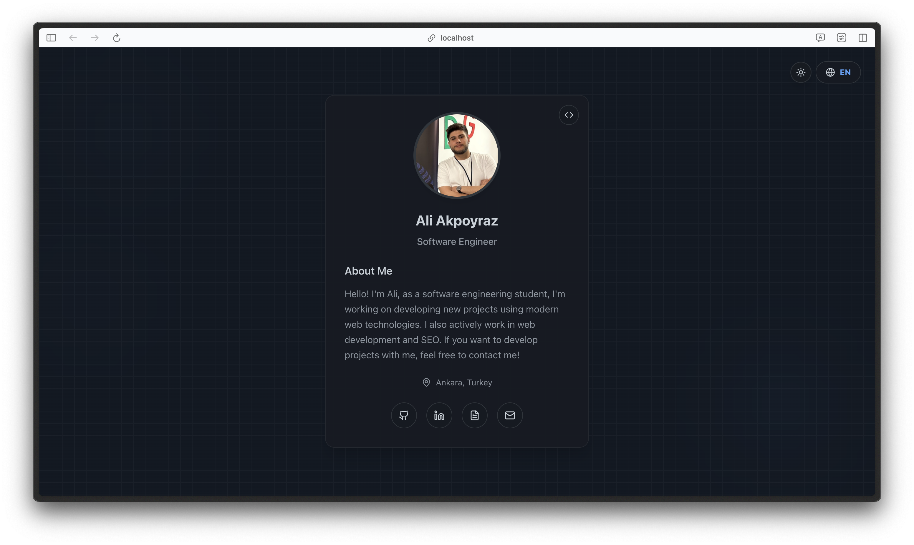
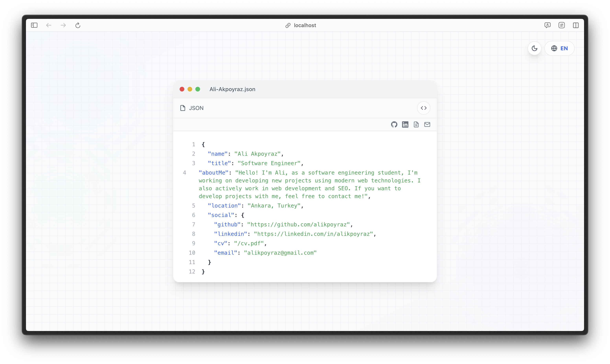
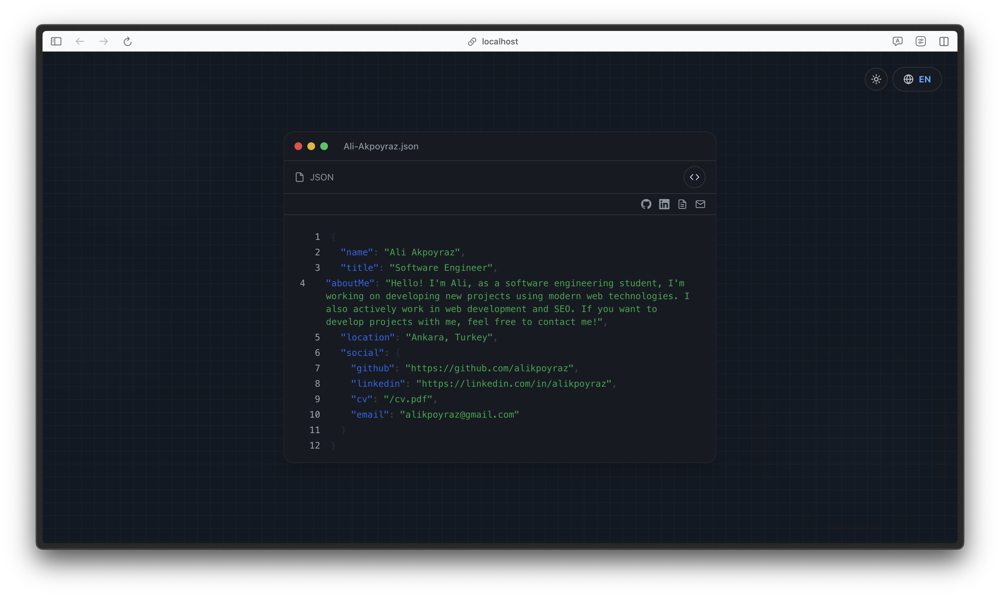
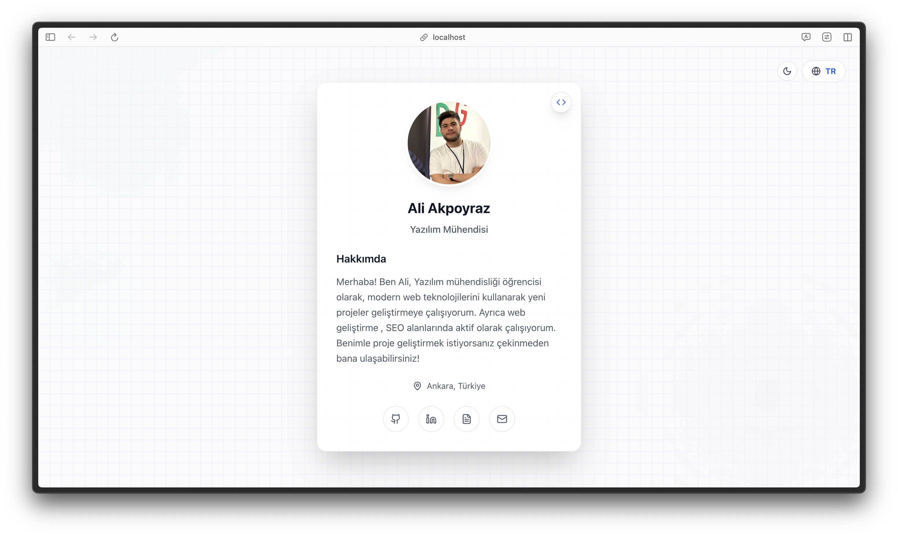
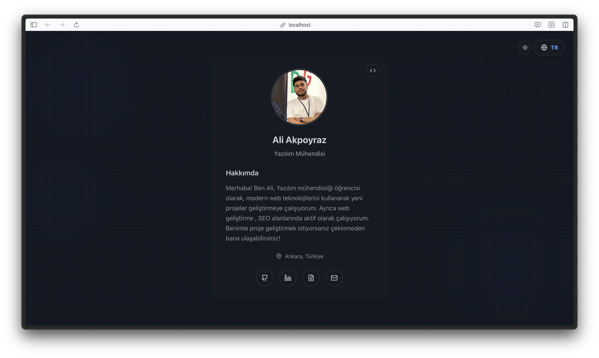
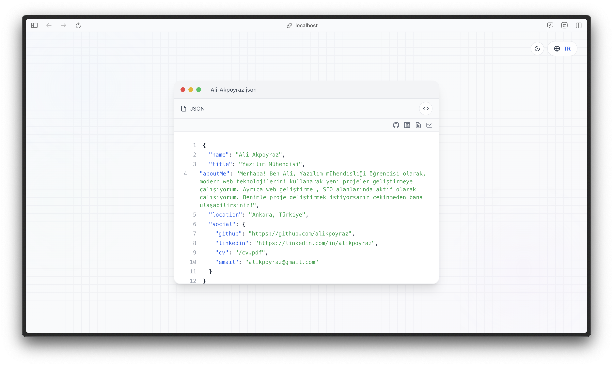
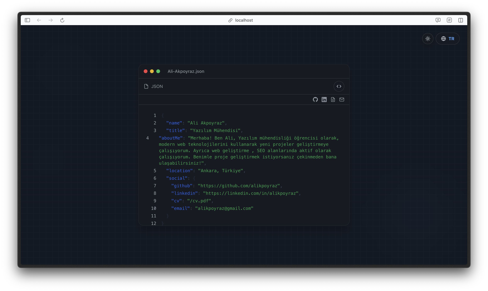

# Modern Portfolio Website | Modern Portfolyo Web Sitesi

[English](#english) | [Türkçe](#turkish)

<a name="english"></a>
## English

A modern, responsive portfolio website built with React, TypeScript, and Tailwind CSS. Features a clean design with dark/light mode support and smooth transitions.    

### Screenshots

#### Light Mode


#### Dark Mode


#### JSON View - Light Mode


#### JSON View - Dark Mode


### Features

- 🌓 Dark/Light mode with system preference detection
- 🌐 Language switching (English/Turkish)
- 🔄 Smooth transitions between views
- 📱 Fully responsive design
- 🎨 Modern UI with Tailwind CSS
- 💻 JSON view mode for developers
- 🎯 Interactive grid background

### Tech Stack

- React
- TypeScript
- Tailwind CSS
- Lucide Icons
- Vite

### Getting Started

1. Clone the repository:
```bash
git clone https://github.com/yourusername/portfolio.git
```

2. Install dependencies:
```bash
cd portfolio
npm install
```

3. Run the development server:
```bash
npm run dev
```

4. Build for production:
```bash
npm run build
```

### Customization

#### Adding New Languages

1. Create a new JSON file in `src/data/` directory
2. Add your translations following the existing format
3. Update the language toggle component

#### Modifying Styles

The project uses Tailwind CSS for styling. You can customize the theme in `tailwind.config.js`.

### Contributing

Contributions are welcome! Please feel free to submit a Pull Request.

### License

This project is licensed under the MIT License - see the [LICENSE](LICENSE) file for details.

---

<a name="turkish"></a>
## Türkçe

React, TypeScript ve Tailwind CSS ile geliştirilmiş modern, duyarlı bir portfolyo web sitesi. Karanlık/aydınlık mod desteği ve yumuşak geçişlerle temiz bir tasarıma sahiptir.

### Ekran Görüntüleri

#### Aydınlık Mod


#### Karanlık Mod


#### JSON Görünümü - Aydınlık Mod


#### JSON Görünümü - Karanlık Mod


### Özellikler

- 🌓 Sistem tercihine göre Karanlık/Aydınlık mod
- 🌐 Dil değiştirme (Türkçe/İngilizce)
- 🔄 Görünümler arası yumuşak geçişler
- 📱 Tamamen duyarlı tasarım
- 🎨 Tailwind CSS ile modern arayüz
- 💻 Geliştiriciler için JSON görünüm modu

### Teknoloji Yapısı

- React
- TypeScript
- Tailwind CSS
- Lucide Icons
- Vite

### Başlangıç

1. Repo'yu klonlayın:
```bash
git clone https://github.com/yourusername/portfolio.git
```

2. Bağımlılıkları yükleyin:
```bash
cd portfolio
npm install
```

3. Sunucuyu başlatın:
```bash
npm run dev
```

4. Derleyin:
```bash
npm run build
```

### Özelleştirme

#### Yeni Dil Ekleme

1. `src/data/` dizininde yeni bir JSON dosyası oluşturun
2. Mevcut formata uygun olarak çevirilerinizi ekleyin
3. Dil değiştirme bileşenini güncelleyin

#### Stil Değişiklikleri

Proje stil için Tailwind CSS kullanmaktadır. Temayı `tailwind.config.js` dosyasından özelleştirebilirsiniz.

### Katkıda Bulunma

Katkılarınızı bekliyoruz! Lütfen bir Pull Request göndermekten çekinmeyin.

### Lisans

Bu proje MIT Lisansı altında lisanslanmıştır - detaylar için [LICENSE](LICENSE) dosyasına bakın.
