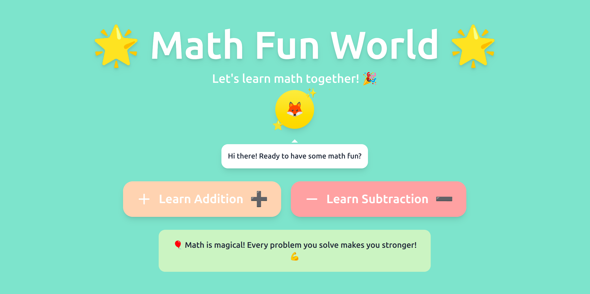

# Math Game for Kids 🎲

This is a fun and interactive math game designed for my 7-year-old daughter! She loves practicing math with this game.

## Live Demo

You can play the game here: [Math Game Live](https://chathurisandeepanialwis.github.io/math-game/)

## How to Play

- Answer the math questions as they appear.
- Try to get as many correct answers as possible!
- Have fun learning math!

## Technologies Used

- HTML, CSS, JavaScript
- GitHub Pages for hosting

---

Made with ❤️ for my daughter.

